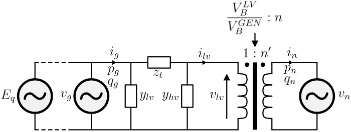
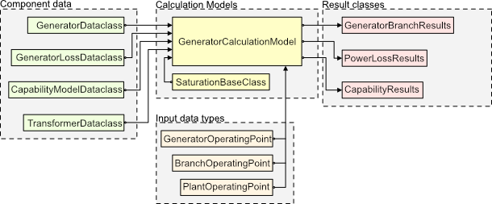

# SynGenLib

**SynGenLib** (Synchronous Generator Library) is an object-oriented Python library that establishes a framework for defining dataclasses of synchronous generators and their respective step-up transformers. Using these dataclasses, one can calculate the power losses and reactive power capability of synchronous machines and their respective step-up transformer. The power loss calculation method is in accordance with [1] for the generator model. The generator reactive power capability is calculated according to [2].

## Directory Organization

The SynGenLib code resides in the `src` folder and is divided into five parts:

- **archive**: Contains old and deprecated code. This folder is not accessible when using the library but is retained for potential future reference.
- **core**: Holds custom exceptions. Currently, this folder is empty.
- **data**: Defines the dataclasses used for storing parameters and result data.
- **models**: Contains calculation models for the generator, transformer, and capability diagram.
- **utils**: Intended for common helper functions and other utility classes. This folder is currently empty.

The `examples` folder contains sample generator and transformer dataclasses, along with scripts demonstrating how to get started with and use SynGenLib.

The `tests` folder includes unit tests for various calculation classes. This is a work in progress.

## Getting Started

To get started with SynGenLib, clone the repository to your local machine using `git` or by downloading the main branch from **GitHub**. Navigate to the repository folder and install the library using:

```bash
pip install .
```

These instructions will set up a local copy of the project for development and testing purposes. See the deployment section for notes on how to deploy the project in a live environment.

`SynGenLib` uses an electrical model representation as follows. The figure highlights that there are two types of operating points that can be used for calculations, and the user are free to choose between any of them. In general, the operating point descripes the active power **P**, reactive power **Q**, and terminal voltage **V** at a specific point. Based on these quantities, electrical quantities can be calculated for the whole branch. The **GeneratorOperatingPoint** is used when electrical quantities at the generator terminal is known. The **BranchOperatingPoint** is used when the electrical quantities on the secondary side of the step-up transformer is known. Both inputs will result in a valid output from the calculation model.



The data modelling of `SynGenLib` is illustrated in the figure below. The only mandatory data model is the **GeneratorDataclass** which includes basic parameter of the synchronous machine. **GeneratorLossDataclass** are used to specify power loss properties of the synchronous generator. **CapabilityModelDataclass** are used to define quantities relevant for calculating reactive power limits of the machine. **TransformerDataclass** defines the step-up transformer parameters. The **SaturationBaseClass** or any child classes are used to define the saturation characteristic of the synchronos machine, and defaults to a linear characteristic if not specified. All of these classes are used to define an instance of the calculation object **GeneratorCalculation**. Given an **Operating Point**, the **GeneratorCalculationModel** can output either of the three result dataclasses: **GeneratorBranchResults**, **PowerLossResults**, or **CapabilityResults**.



### Prerequisites

Dependencies for SynGenLib are listed in the TOML file. The notable tools are `numpy` and `scipy`. If you run examples, `matplotlib` is needed.

## Authors

- **Emil G. Melfald**, University of South-Eastern Norway

## License

This project is licensed under the MIT License. See the [LICENSE](./LICENSE) file for details.

## Acknowledgments

This library is inspired by the work presented in references [1] and [2].

## Citation

- [1] E. d. C. Bortoni, R. T. Siniscalchi, S. Vaschetto, M. A. Darmani, and A. Cavagnino, “Efficiency mapping and weighted average efficiency for large hydrogenerators,” IEEE Open J. Ind. Appl., vol. 2, pp. 11–20, 2021.
- [2] J. Machowski, Z. Lubosny, J. W. Bialek, and J. R. Bumby, *Power System Dynamics: Stability and Control*, Third Edition. Wiley, 2020.
