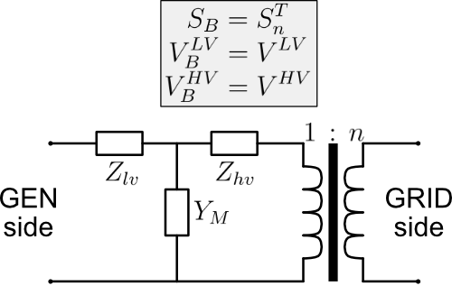
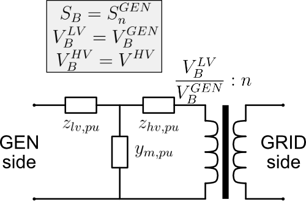
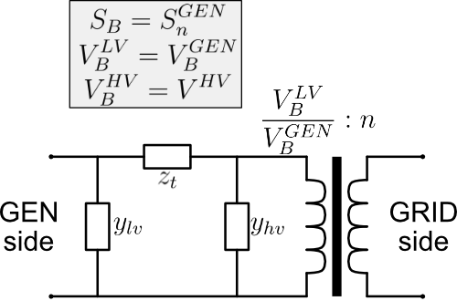

# Transformer Model Conversion

Between the models in SynGenLib the transformer model is the most involved to handle. This stems from two factors:

* The power and voltage ratings may differ between the generator and transformer, leading to two different per-unit systems in the generator and transformer parameters.
* The tap changer will cause additional changes in the voltage base at the LV side of the transformer.

Here we show how the parameters specified in the **`TransformerDataclass`** is converted to the correct per-unit quantities to be used directly with the generator model for correct calculation of voltages and power flows.

## From transformer parameters to an electrical circuit

We assume a transformer can be modeled as shown in Figure 1. The circuit parameters can be found from the **`TransformerDataclass`** using the following equations.

$$
\begin{aligned}
X_{SCH} = \sqrt{V_{SCH}^2 - P_{Cu}^2} \\
Z_{hv} = (P_{Cu} + jX_{SCH})\cdot (1 - Z_\text{lv-ratio}) \\
Z_{lv} = (P_{Cu} + jX_{SCH})\cdot (Z_\text{lv-ratio}) \\
B_M = \sqrt{I_E^2 - P_{Fe}^2} \\
Y_M = P_{Fe} - jB_M
\end{aligned}
$$

## Changing power and voltage base

In many cases the transformer power and LV-voltage rating differs from the generator ratings. We require all impedances to be in the same per-unit system, and SynGenLib always chooses the generator base system. This means the impedances in our transformer circuit must be converted to the generator base. The resulting circuit is shown in Figure 2. Note that doing this also changes the apparent tap-ratio of the transformer as we now account for the changed base voltage at the transformer secondary side.

$$
\begin{aligned}
\text{base-change factor} = \Theta = \frac{S_n^{GEN}}{S_n^{TRAFO}} \cdot \left(\frac{V^{LV}}{V_n^{GEN}}\right)^2 \\
z_{lv,pu} = \Theta Z_{lv} \\
z_{hv,pu} = \Theta Z_{hv} \\
y_{m,pu} = Y_M / \Theta
\end{aligned}
$$

## Transform from star-connection to delta-connection

To be compatible with power flow studies, and also for ease of calculating voltages and currents at any side of the transformer, SynGenLib builds an ABCD matrix from the transformer circuit such that:

$$\begin{bmatrix} V_{hv} \\ I_{hv} \end{bmatrix} =
\begin{bmatrix} A & B \\ C & D \end{bmatrix}
\begin{bmatrix} V_{lv} \\ I_{lv} \end{bmatrix} $$

The equations for the ABCD factors are:

$$
\begin{aligned}
A = 1 + y_{m,pu} \cdot z_{lv,pu} \\
B = z_{lv,pu} + z_{hv,pu} + y_{m,pu} \cdot z_{lv,pu} \cdot z_{hv,pu} \\
C = y_{m,pu} \\
D = 1 + y_{m,pu} \cdot z_{hv,pu}
\end{aligned}
$$

To obtain the circuit in Figure 3 SynGenLib extracts the parameters from the ABCD factors in the following way:

$$
\begin{aligned}
z_t = B \\
y_{lv} = (D - 1) / B \\
y_{hv} = (A - 1) / B
\end{aligned}
$$
