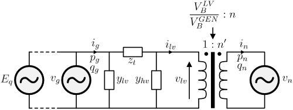

# BranchCalculationModel

The following text works as the documentation for the BranchCalculationModel and includes the circuit and calculation model for the generator-transformer branch and the capability diagram.

## Branch result calculations

The following equations assumes that the transformer has been converted to the ABCD factors as detailed in the transformer documentation. To simplify the analysis we also use a per-unit transformer tap ratio called **`n'`**. Also note that all lower-case symbols represents per-unit values refered to their respective base. All voltages on the LV-side of the transformer is refered to the generator rated voltage $V_B^{GEN}$ while the voltage at the HV-side of the transformer is refered to the grid voltage $V_B^{HV}$.

The relation between the HV side and the LV side of the transformer is expressed as:

$$
\begin{aligned}
n' = n \cdot \frac{V_B^{GEN}}{V_B^{LV}}
v_n = v_{lv} n' \\
i_n = i_{lv} / n'
\end{aligned}
$$

Assuming the ABCD factors from the transformer is already calculated, the relation between the HV and LV side of the transformer voltage and current is:

$$
\begin{aligned}
v_g = A v_{lv} + B i_{lv} \\
i_g = C v_{lv} + D i_{lv}
\end{aligned}
$$

The power on each side of the transformer can be calculated as:

$$
\begin{aligned}
p_n + jq_n = v_n i_n^* = v_{lv} i_{lv}^* \\
p_g + jq_g = v_g i_g^*
\end{aligned}
$$

The internal voltage of the generator can be calculated as:

$$
E_q^2 = v_g^2\left( \left(1+x_d \frac{q_g}{v_g^2}\right)^2 + \left(x_d \frac{p_g}{v_g^2}\right)^2 \right)
$$

## Capability diagram and Q-limits

One major assumption in the reactive power limit calculations is that we always assume that we know the grid voltage and $p_n$. If a **`GeneratorOperatingPoint`** or **`PlantOperatingPoint`** is provided, SynGenLib will first calculate the branch solution and then use the calculated values for $V_n$ and $p_n$ to proceed with the reactive power solution. The reactive power limits resulting from the following calculations are always refered to at the HV side of the transformer and represents the $q_n$ value.

### Stator limits

Ignoring the shunt admittances, we can approximate the maximum $i_n$ current as:

$$
\begin{aligned}
i_n^{max} \approx i_g^{max} / n' \\
s_n^{max} = v_n i_n^{max}
\end{aligned}
$$

If $s_n^{max} \le p_n$ then there even with zero reactive power injection the stator limit is violated. Therefore, at this condition the stator limit calculation returns **`nan`** for the $q_{min}$ and $q_{max}$, and a flag called **`valid`** which is set to **`false`**. Otherwise, the limits are calculated as:

$$ q_{lim}^2 = (s_n^{max})^2 - p_n^2 $$

The function that calculates the stator limit then returns $q_{min}=-q_{lim}$, $q_{max}=q_{lim}$ and the **`valid`** flag is set to **`true`**.

### Rotor limit (only $q_{max}$)

SynGenLib assumes no shunt currents in the transformer during the rotor limit calculation. I also neglects the transformer resistance. The series impedance of the transformer is $z_t = r_t + jx_t$. The total reactance from the HV terminal to the internal voltage of the generator is $x_{tot} = x_d + x_t$. Obtaining the rotor limit is done by solving the equation for $E_q^2$ as shown above. We substitude $x_d$ for $x_{tot}$, $v_g$ for $\frac{v_n}{n'}$, and $E_q$ for $E_q^{max}$. Solving this equation gives:

$$
q_{lim} = \frac{v_n}{n' x_{tot}} \pm \sqrt{\left( \frac{E_q^{max}v_n}{n' x_{tot}} - p_n \right)\left(\frac{E_q^{max}v_n}{n' x_{tot}} + p_n \right)}
$$

First, if the term $\frac{E_q^{max}v_n}{n' x_{tot}} \le p_n$ then the rotor current is invalid (no solution) and the function returns **`nan`** and a **`valid`** flag that is **`false`**. Otherwise, calculation returns the positive part of the above equation.

### Stability limit (only $q_{min}$)

The maximum allowed generator angle is noted $\delta^{max} and is noted as the stability limit. The minimum reactive power that stil is within this stability limit is calculated as:

$$ q_{lim} = \tan^{-1}(\delta^{max}) p_n - \frac{v_n}{n' x_{tot}} $$

### Voltage limits

The reactive power is constrained by the voltage limits allowed on the generator terminal. There is a minimum and maximum limit, and **`min`** or **`max`** can replace the **`lim`** in the following equation to obtain $q_{min}$ and $q_{max}$.
$$
\begin{aligned}
p_n \approx \frac{v_n v_g^{lim}}{n' x_t}\sin(\delta) \\
\delta^{lim} = \sin^{-1}\left( \frac{p_n x_t n'}{v_n v_g^{lim}} \right) \\
q_{lim} = \frac{v_n v_g^{lim}}{n x_t} \cos \delta^{lim} - \frac{v_n^2}{(n')^2 x_t}
\end{aligned}
$$
